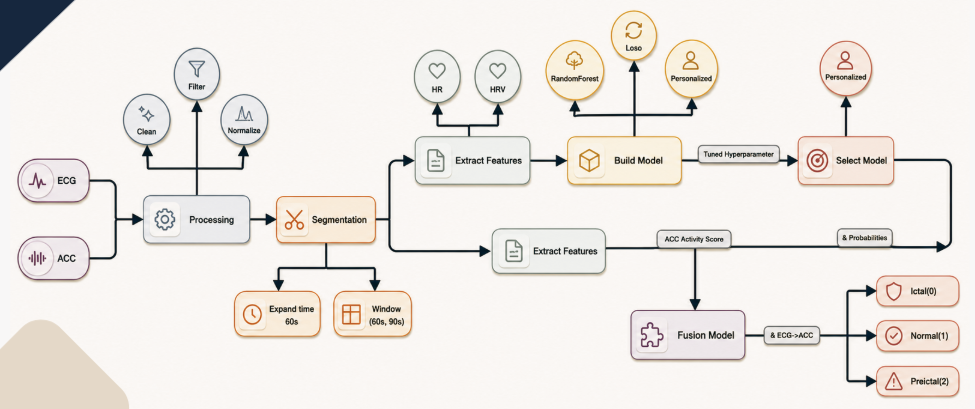

# AI-Seizure-Prediction

--------
## DESCRIPTION

This repository contains the Artificial Intelligence (AI) module of the **Smart System for Early Prediction of Epileptic Seizures (EPIXA)**.
The AI system analyzes ECG signals acquired from a wearable device to predict epileptic seizures before onset. It combines biomedical signal processing, feature engineering, and personalized machine learning to identify seizure-related patterns from cardiac activity.
A personalized Random Forest classifier is trained for each patient to improve prediction performance. To further enhance reliability, ECG-based predictions are combined with motion information extracted from accelerometer (ACC) signals using a multimodal fusion strategy.

### AI Workflow

--------

# Table of Contents

- [Preprocessing](#preprocessing)
- [Feature Engineering](#feature-engineering)
- [AI Model](#ai-model)
- [Multimodal Fusion](#multimodal-fusion)
- [Performance Evaluation](#performance-evaluation)
- [Results](#results)
- [Repository Structure](#repository-structure)
- [Usage](#usage)
- [Related Repositories](#related-repositories)

--------
## Preprocessing
Raw signals undergo several preprocessing steps to improve signal quality before feature extraction. These steps reduce noise, remove unwanted interference, normalize signal amplitude, and segment the recordings into fixed-length windows suitable for machine learning.

The preprocessing pipeline includes:

- Band-pass filtering
- Notch filtering
- cleaning
- Signal normalization
- Window segmentation

<table>
<tr>

<td width="40%">

<b>Raw ECG Signal</b>

<b>Preprocessed ECG Signal</b>

</td>

<td width="60%" align="center">

<b>Raw and Preprocessed ACC Signal</b>

</td>

</tr>
</table>

------------
## Feature Engineering
Meaningful physiological features are extracted from both ECG and accelerometer (ACC) signals to capture cardiac and movement patterns associated with epileptic seizures.

For the ECG signal, heart rate (HR), heart rate variability (HRV), and statistical features are extracted. For the ACC signal, motion-related features describing the patient's physical activity are computed.

Feature selection is independently performed for both ECG and ACC features using the **Kruskal–Wallis H-test**, a non-parametric statistical method that compares feature distributions across different physiological states. Features with high H-statistics and statistically significant p-values are selected, retaining the most discriminative cardiac and motion features for seizure prediction while reducing feature redundancy.

<table>
<tr>

<td align="center" width="50%">
 
<b>ECG Feature Extraction</b>
</td>

<td align="center" width="50%">
 
<b>ACC Feature Extraction</b>
</td>

</tr>
</table>

---------------------------

## AI Model
A personalized Random Forest classifier is employed as the primary prediction model. Instead of training a single global model, an independent model is built for each patient to better capture individual physiological patterns.

Hyperparameter optimization is performed to identify the best model configuration and maximize prediction performance.

| Item | Description |
|------|-------------|
| Algorithm | Random Forest |
| Learning Strategy | Personalized |
| Optimization | Hyperparameter Tuning |
| Output | Seizure Prediction |

-------------------------

## Multimodal Fusion

To further improve seizure prediction reliability, the proposed framework combines ECG-based prediction probabilities with motion-related information extracted from accelerometer (ACC) signals. This multimodal fusion strategy exploits complementary physiological information, resulting in a more robust prediction system and reducing false alarms.

The fusion model receives the class probabilities generated by the personalized ECG model together with the ACC activity score as input features. These inputs are combined using a weighted fusion equation:

**Fusion Score = 0.6 × ECG + 0.4 × ACC**

A personalized Random Forest classifier is then trained independently for each patient using **200 decision trees**, **balanced class weights**, and a fixed **random state of 42** to ensure reproducibility. The model predicts one of three physiological states: **Ictal**, **Preictal**, or **Normal**.

## 🔗 Related Repositories

- [Project Overview](https://github.com/Reemwael720/Smart-System-for-Early-Prediction-of-Epileptic-Seizures-EPIXA-)

- [Wearable-Seizure-Detection-Hardware](https://github.com/Reemwael720/Wearable-Seizure-Detection-Hardware)

- [Seizure-Alert-Mobile-App](https://github.com/Reemwael720/Seizure-Alert-Mobile-App)
